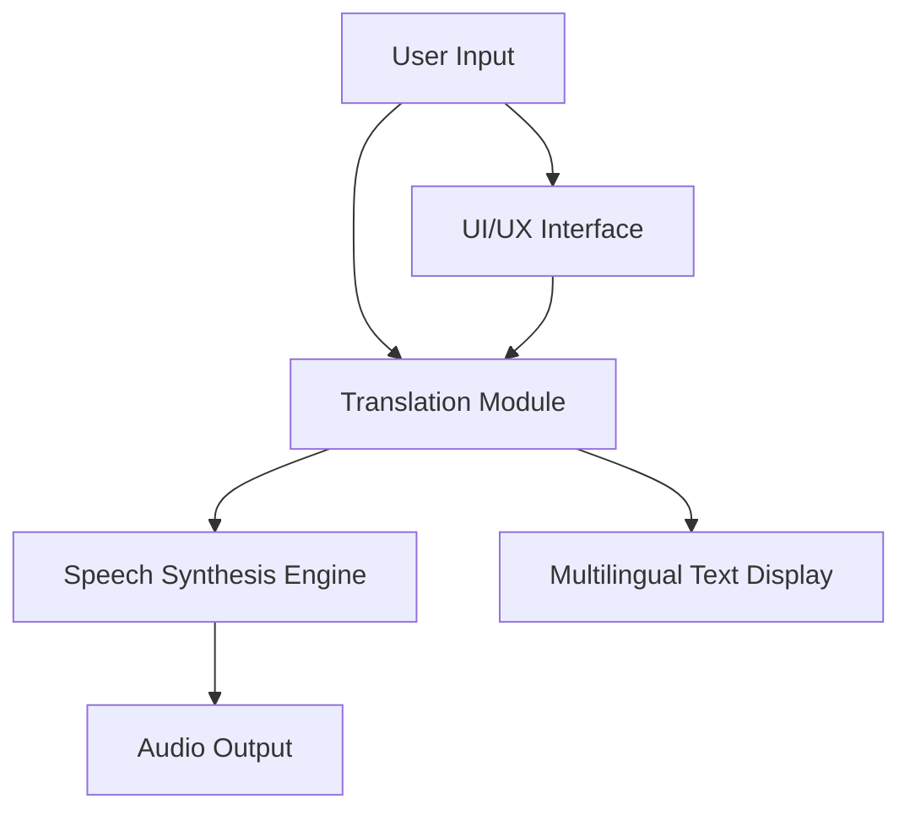

# 🩺 Aroghyabhashini  
> Empowering Communication Through Technology

---

## 🧠 Project Overview  

**Aroghyabhashini** is an innovative assistive communication system designed to give voice to the voiceless — specifically for individuals who cannot speak or have severe speech impairments.  

The system uses **AI**, **translation**, and **speech synthesis technologies** to interpret user input (typed, selected, or sensor-based) and convert it into **natural-sounding speech**.  

The name “Aroghyabhashini” symbolizes *“Healthy Speech”* — a voice for those who cannot speak.  

### 🎯 Our Goal
To develop a scalable, accessible, and AI-powered communication platform that helps mute or speech-impaired people express their thoughts clearly and confidently.

---

## 💡 Problem Statement

Millions of people around the world suffer from conditions that make verbal communication difficult or impossible (e.g., laryngectomy, neurological disorders, or congenital conditions).  
Traditional assistive devices are often expensive or inaccessible.  

**Aroghyabhashini** aims to change this by providing an **affordable, AI-driven, multilingual communication assistant** — one that works on both web and hardware interfaces.

---

## 🔍 Key Features  

✅ **Text-to-Speech Conversion** – Converts typed or selected text into clear, natural speech.  
✅ **Multilingual Support** – Supports Indian regional languages for inclusivity.  
✅ **Translation API Integration** – Automatically translates between languages before speech output.  
✅ **Clean & Accessible UI** – Simple interface designed for users with limited mobility.  
✅ **Cloud-Backed Architecture** – Ensures data safety and scalability.  
✅ **Real-Time Voice Generation** – Fast, accurate, and expressive voice synthesis.  

---

## 🧱 Tech Stack  

| Layer | Technologies Used |
|-------|-------------------|
| **Frontend** | React, TypeScript, Vite |
| **UI / Styling** | Tailwind CSS, shadcn-ui |
| **APIs / Services** | Bhashini API |
| **Version Control** | Git & GitHub |

---

## 📂 Repository Structure  

```
The_Linkers-Megathon-25/
├── public/
├── src/
│   ├── components/
│   ├── pages/
│   ├── assets/
│   └── main.tsx
├── supabase/
├── package.json
├── vite.config.ts
├── tailwind.config.ts
├── postcss.config.js
├── tsconfig.json
├── .env
├── Abstract.txt
└── README.md
```

---

## ⚙️ Installation & Setup  

Follow these steps to run the project locally 👇  

1. **Clone the Repository**
   ```bash
   git clone https://github.com/SairamMekala22/The_Linkers-Megathon-25.git
   cd The_Linkers-Megathon-25
   ```

2. **Install Dependencies**
   ```bash
   npm install
   ```

3. **Set Environment Variables**
   - Copy `.env.example` to `.env`
   - Add your API keys and Supabase URL/credentials.

4. **Run in Development Mode**
   ```bash
   npm run dev
   ```

5. **Build for Production**
   ```bash
   npm run build
   ```

6. **Preview the Build**
   ```bash
   npm run preview
   ```

---

## 🧩 System Architecture  



---

## 🧠 Workflow  

1. User enters or selects input text.  
2. The system sends text to a translation API (if needed).  
3. The translated text is passed to a speech synthesis engine.  
4. The engine converts it into audible output in real time.  
5. The user hears the generated voice output through speakers.  

---

## 🎨 UI Highlights  

- Minimalistic design for accessibility  
- Large buttons and simple navigation  
- Dark/light mode options  
- Responsive design for web and mobile  

---

## 👩‍💻 Team Members  

| Name |
|------|
| **Sairam Mekala** |
| **Mallu Ram Charan Reddy** | 
| **Racharla Rakesh** | 
| **Akhilesh Rao** | 
| **Narina Ram Charan Teja** | 

---

---

## 🧪 Testing & Validation  

- ✅ Integration tests for API workflows  
- ✅ Accessibility and performance checks  
- ✅ Usability testing with real users  

---

## 🏗️ Challenges Faced  

- Handling multilingual model latency  
- Maintaining accuracy across diverse accents  
- Balancing UI simplicity with feature richness  

---

## 💬 Outcomes  

- Functional prototype developed and deployed  
- Demonstrated real-time voice conversion  

---

## 📜 License  

```
MIT License  
© 2025 The Linkers — Aroghyabhashini Project Team, KMIT
```

---


---

## 📞 Contact  

**GitHub:** [SairamMekala22](https://github.com/SairamMekala22)  
**Email:** sairam.mekala@example.com *(replace with actual email)*  
**Project Repo:** [Aroghyabhashini](https://github.com/SairamMekala22/The_Linkers-Megathon-25)  

---

> “Technology gives voice to those unheard — Aroghyabhashini brings that voice to life.”
